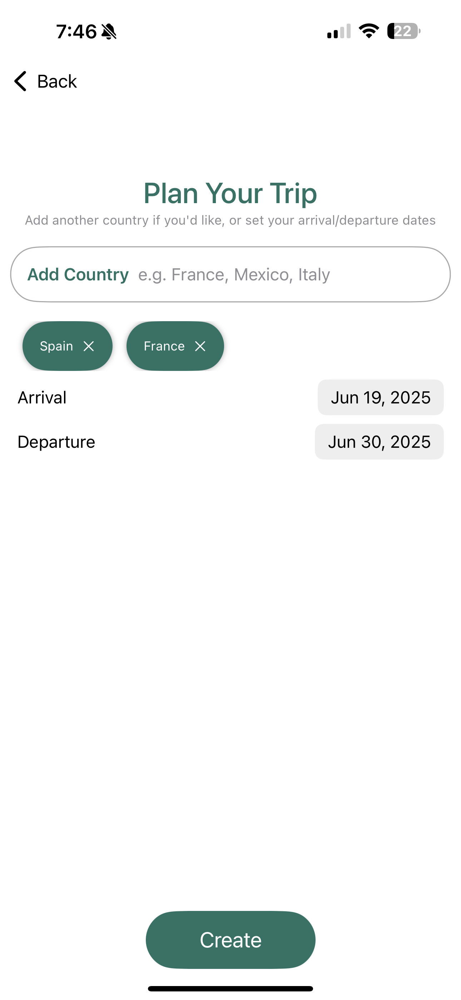
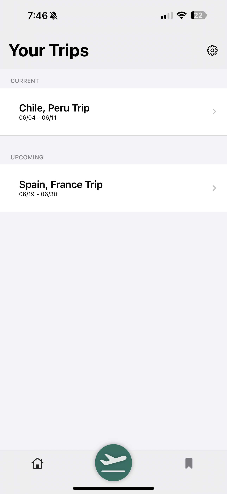
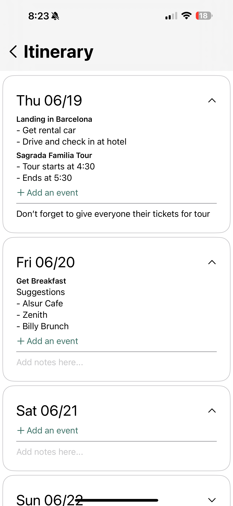

# Travel App
## Overview

The **Travel App** is an iOS application designed to help with travel planning.
This project integrates itinerary management, destination exploration, and travel-related data visualization. 

## Installation and Setup

### Prerequisites
- **Xcode**: Install the latest version from the Mac App Store.

### Steps
1. Clone the repository:
   ```bash
   git clone https://github.com/sebas-ib/travel-app.git
   cd travel-app
```
1. Open the project in Xcode:
   ```bash
   open Travel.xcodeproj
```

1. Build and run the app on a simulator or a connected iOS device.

## Directory Structure
```bash
.
├── Travel/           # Main iOS app source files
├── TravelTests/      # Unit testing framework
├── TravelUITests/    # UI testing files
├── uploadScript/     # Python scripts
└── README.md         # Project documentation
```


## Screenshots
### Itinerary Creation


### View Trips


### Trip Itinerary Editor

